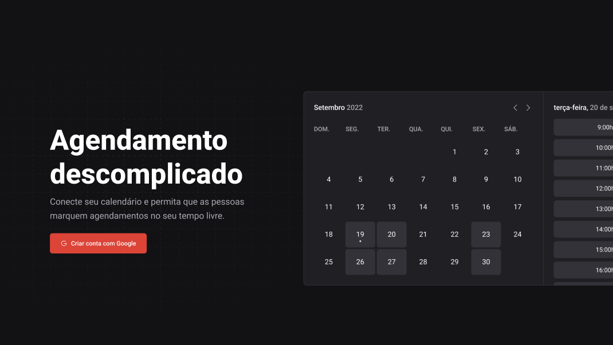

<h1>
  
</h1>

## 💻 Projeto

O Ignite Call é uma aplicação desenvolvida durante a trilha de React Native do Ignite 2022. O objetivo da aplicação é agendar chamadas de vídeo e conferências, utilizando a integração com a API do Google e o Google Calendar. O projeto é desenvolvido como uma aplicação full stack utilizando o framework Next.js e suas APIs routes. Para o deploy da aplicação, utilizamos a plataforma Planet Scale para o banco de dados e a Vercel para hospedar a aplicação.

## ✨ Tecnologias

O projeto utiliza as seguintes tecnologias:

- [TypeScript](https://www.typescriptlang.org/)
- [Axios](https://axios-http.com/docs/intro)
- [React Hook Form](https://react-hook-form.com/)
- [Zod](https://github.com/colinhacks/zod)
- [Next.js](https://nextjs.org/)
- [Prisma](https://www.prisma.io/)
- [TanStack-ReactQuery](https://tanstack.com/query/v4)
- [Day.js](https://day.js.org/)

## 🚀 Como executar o projeto

Siga as instruções abaixo para executar o projeto em sua máquina:

1. Clone este repositório.
2. Acesse a pasta do projeto.
3. Instale as dependências utilizando o NPM ou Yarn: `npm install ou yarn install`
4. Inicie o servidor do Next.js: `npm start dev`
5. Em ambiente de desenvolvimento, é necessário configurar um container com o MySQL para o banco de dados.

---

## 🎨 Layout

O layout da aplicação está disponível no Figma:

